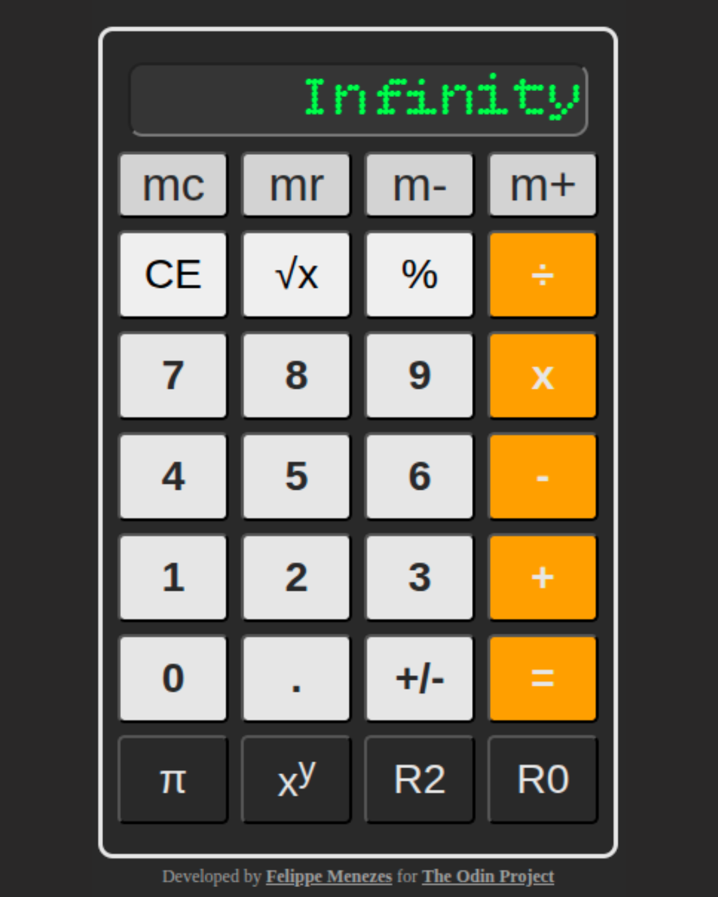

# project-calculator
A web-based calculator featuring core arithmetic operations, input validation, and real-time display updates. Built with a focus on clean logic and UI interaction without using `eval()`. Part of The Odin Project journey.

## 🚀 Live Demo
[View the Live Preview here](https://felippemenezes.github.io/project-calculator/)

## 🚀 Preview

## 🛠️ Technologies Used
*   **HTML5:** Structural foundation of the calculator.
*   **CSS3:** Styling and layout for a responsive interface.
*   **JavaScript:** Core logic, arithmetic operations, and event handling.
*   **Git:** Version control and workflow management.
*   **GitHub:** Project hosting and documentation.

## 📝 Features
*   **Core Arithmetic:** Support for addition, subtraction, multiplication, division, and exponentiation ($x^y$).
*   **Advanced Functions:** Includes square root, percentage logic, and sign toggling (+/-).
*   **Memory Operations:** Fully functional memory buttons (MC, MR, M-, M+) to store and retrieve values.
*   **Precision Control:** Dedicated buttons to round results to 0 or 2 decimal places.
*   **Audio Feedback:** Interactive sound effects for mouse clicks (down/up states) to enhance user experience.
*   **Smart Logic:** Handles chained operations and repeats the last operation when pressing "=" consecutively.
*   **Input Validation:** Prevents invalid number formats and manages the "AC/CE" clear states dynamically.

## 🕹️ How to Use
1.  **Input:** Use the numeric keypad to enter values.
2.  **Operate:** Select an operator and enter the second number.
3.  **Result:** Press "=" to calculate or use the rounding/memory buttons for specific adjustments.
4.  **Clear:** Use "CE" to clear the current entry or "AC" to reset the entire state.

## 🧠 What I Learned
During this project, I reinforced my knowledge of:
*   **Object Mapping:** Using JavaScript objects to map operations instead of `eval()`.
*   **State Management:** Tracking multiple variables (`firstNumber`, `operation`, `lastOperation`) to handle complex calculation sequences.
*   **Event Listeners:** Implementing `mousedown` and `mouseup` to sync UI actions with audio feedback.
*   **DOM Manipulation:** Dynamically updating display values, placeholders, and button labels based on the application state.
*   **Mathematical Logic:** Implementing context-aware percentage calculations and precision handling.

## 📄 Acknowledgments
*   Project inspired by The Odin Project - Calculator Assignment.
